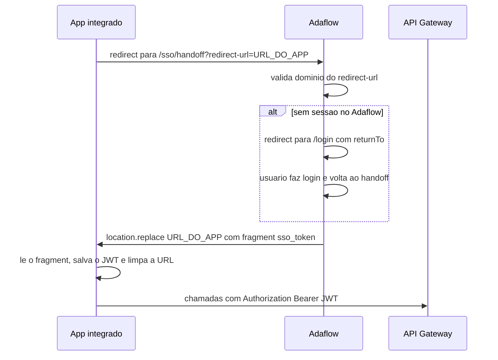

> **Fonte:** este guia é mantido em sincronia com `adalink-platform/docs/INTEGRATED-APPS-GUIDE.md`.
> Mudanças de contrato nascem lá e são espelhadas aqui.

# Guia de uso para apps integrados com Adaflow

Este guia é para desenvolvedores de **apps integrados** à plataforma Adalink:
aplicações internas ou parceiras (ex.: gestão, koder) hospedadas em domínios
`*.adalink.ai` / `*.adalink.app` que usam o **Adaflow como Identity Provider**
e consomem as APIs da plataforma através do **API Gateway**
(produção: `https://adalink-api-gateway.onrender.com`).

Ele cobre as três superfícies de integração:

| Superfície | Quando usar | Credencial |
|---|---|---|
| **SSO com Adaflow** (seção 1) | Autenticar o usuário no seu app sem tela de login própria | Sessão do Adaflow → JWT |
| **API de agentes autônomos** (seção 2) | Executar um agente específico da organização passando o `agentId` | JWT do usuário |
| **Chat OpenAI-compatible** (seção 3) | Chat genérico com qualquer modelo do catálogo, usando SDKs OpenAI | JWT do usuário (preferido) ou app token |
| **Especialistas via `assistant:<uuid>`** (seção 3.2) | Conversar com um especialista da organização — com RAG, skills, conectores, memória server-side e governança | JWT do usuário (preferido) ou app token |
| **Repositórios de conhecimento** (seção 4) | Criar bases de documentos, subir arquivos e vinculá-los ao RAG dos especialistas | JWT do usuário (`ADMIN`/`CREATOR`) |

## Credenciais: prefira o JWT do usuário logado

O gateway aceita duas credenciais, mas elas **não são equivalentes** — a regra
é:

> **Sempre que houver um usuário logado no fluxo, use o JWT dele**
> (`Authorization: Bearer <jwt>`, obtido via SSO handoff — seção 1).
> **Só quando não há usuário logado** (backend server-side, job agendado,
> integração headless) use um **app token** no header `x-ada-token`.

| | **JWT do usuário (preferido)** | **App token (`x-ada-token`)** |
|---|---|---|
| Como enviar | `Authorization: Bearer <jwt>` | Header `x-ada-token: <token>` |
| Como obter | SSO handoff (seção 1) | `POST /gateway/app-tokens` (listar: `GET`; rotacionar: `POST /gateway/app-tokens/:id/rotate`) |
| Vida útil | Curta — renovado de graça refazendo o handoff | Longa — segredo que precisa ser guardado, rotacionado e revogável |
| Quem "assina" a ação | O usuário real da sessão, com role e permissões **atuais** | O usuário que **criou** o token — o contexto (usuário, organização, role) é pinado na criação |
| Quando usar | Toda ação feita a partir da UI do seu app, em nome de quem está usando | Server-to-server, sem browser/sessão no fluxo |

Por que essa ordem importa:

- **Auditoria correta** — com o JWT, cada execução de agente e cada mensagem
  fica atribuída ao usuário real. Com app token, *tudo* que o seu app fizer é
  atribuído ao usuário criador do token, independentemente de quem estava na
  tela.
- **Menos risco** — o JWT expira rápido e não é um segredo armazenado; o app
  token é um segredo de longa duração (vaza → precisa revogar/rotacionar).
- **RBAC vivo** — o JWT reflete o role e as permissões do usuário no momento
  da chamada; o app token carrega o contexto pinado na criação.

Cuidados:

- **Não envie os dois ao mesmo tempo**: se `x-ada-token` e `Authorization`
  vierem juntos, o gateway resolve o `x-ada-token` **primeiro** — o Bearer é
  ignorado.
- **Exceção do `/v1/openai`**: somente nesse prefixo o app token também é
  aceito como `Authorization: Bearer` (é a "API key" dos SDKs OpenAI, que não
  sabem enviar header custom). Fora dele, Bearer é sempre JWT.
- Tokens criados antes do multi-org (sem organização pinada) são rejeitados
  como `legacy_token` — rotacione ou crie um novo.

Em ambos os casos o gateway é o único ponto de validação: ele resolve a
credencial e injeta o contexto (`organizationId`, `userId`, permissões) para
os serviços downstream. Seu app **nunca** informa `organizationId` no body —
ele vem sempre da credencial.

---

## 1. SSO com Adaflow (handoff)

O Adaflow é o Identity Provider da plataforma. Seu app não implementa tela de
login: ele redireciona o browser para o Adaflow, que devolve o JWT da sessão
via fragment de URL.

### Fluxo



Passo a passo:

1. **Redirecione o browser** para:

   ```
   https://<adaflow>/sso/handoff?redirect-url=<url-do-seu-app>
   ```

   O `redirect-url` deve ser a URL completa (URL-encoded) para onde o token
   será entregue no seu app.

2. **Validação do destino** (proteção contra open redirect / roubo de sessão):
   o Adaflow só entrega o token se o `redirect-url` for `https` (http apenas
   em `localhost`/`127.0.0.1`, para dev) **e** o host for exatamente
   `adalink.ai` / `adalink.app` ou um subdomínio deles
   (`ALLOWED_SSO_REDIRECT_HOSTS`). Destino fora da allowlist → tela
   "Aplicativo não autorizado" e nenhum token é entregue.

3. **Com sessão ativa**, o Adaflow redireciona de volta entregando o JWT no
   **fragment** da URL:

   ```
   <url-do-seu-app>#sso_token=<jwt-url-encoded>
   ```

   O fragment é usado de propósito: o browser não o envia ao servidor nem o
   vaza pelo header `Referer`.

4. **Sem sessão**, o Adaflow redireciona para
   `/login?returnTo=/sso/handoff?redirect-url=...`; após o login o usuário
   volta automaticamente ao handoff e o token é entregue (passo 3).

5. **No seu app**, leia o fragment, extraia o token, **limpe a URL** e use o
   JWT nas chamadas ao gateway:

   ```ts
   // No load da página de destino do redirect-url
   const params = new URLSearchParams(window.location.hash.slice(1));
   const token = params.get('sso_token');
   if (token) {
     sessionStorage.setItem('adaflow:jwt', decodeURIComponent(token));
     // Remove o token do histórico do browser
     history.replaceState(null, '', window.location.pathname + window.location.search);
   }

   // Nas chamadas à API
   const res = await fetch('https://adalink-api-gateway.onrender.com/v1/autonomous-agents', {
     headers: { Authorization: `Bearer ${sessionStorage.getItem('adaflow:jwt')}` },
   });
   ```

6. **Expiração**: o JWT é de curta duração. Ao receber `401` do gateway,
   refaça o handoff (redirecione novamente para `/sso/handoff?redirect-url=...`).
   Se a sessão do Adaflow ainda existir, o ciclo é transparente para o
   usuário — ele volta ao seu app já com um token novo, sem digitar senha.

> **Nota — `/sso/finish` não é para apps integrados.** Existe uma variante de
> handoff (`/sso/finish#ott=...` + `POST /v1/auth/sso/handoff/exchange`) usada
> internamente pelo próprio Adaflow em domínios white-label, para trocar um
> one-time token por cookie de sessão após callbacks OIDC. Apps parceiros usam
> apenas o fluxo `/sso/handoff?redirect-url=` descrito acima.

---

## 2. API de agentes autônomos (JWT + `agentId`)

Executa um agente autônomo da organização passando o id dele. Rotas do
agents-service, expostas via gateway sob o prefixo **`/v1/autonomous-agents`**.

Autenticação: `Authorization: Bearer <JWT do handoff>`. A organização e o
usuário vêm do token. Requer a permissão `autonomous-agents.execute` (scope
`write`); o `:id` é sempre UUID.

| Método | Rota | Descrição |
|---|---|---|
| `GET` | `/v1/autonomous-agents` | Lista os agentes da organização (paginado) — use para descobrir o `agentId` |
| `GET` | `/v1/autonomous-agents/:id` | Detalhe de um agente |
| `POST` | `/v1/autonomous-agents/:id/execute` | Execução **síncrona** — responde ao final |
| `GET` | `/v1/autonomous-agents/:id/stream` | Execução com **streaming SSE** |

### Execução síncrona

```bash
curl -X POST "https://adalink-api-gateway.onrender.com/v1/autonomous-agents/<agentId>/execute" \
  -H "Authorization: Bearer $ADALINK_JWT" \
  -H "Content-Type: application/json" \
  -d '{
    "input": "Quais são os produtos mais vendidos este mês?",
    "threadId": "thread-opcional-para-manter-contexto"
  }'
```

Body (`ExecuteAgentDto`):

| Campo | Tipo | Obrigatório | Descrição |
|---|---|---|---|
| `input` | string (máx. 50.000) | sim | Mensagem ou comando para o agente |
| `threadId` | string | não | Id de thread para manter contexto entre execuções — reenvie o mesmo valor nas chamadas seguintes |

Resposta (`AgentExecutionResponseDto`):

```json
{
  "id": "<execução>",
  "agentId": "<agentId>",
  "input": "Quais são os produtos mais vendidos este mês?",
  "output": "Os produtos mais vendidos este mês são: ...",
  "threadId": "thread-opcional-para-manter-contexto",
  "status": "completed"
}
```

`status` ∈ `pending | running | completed | failed | cancelled`; em falha, o
campo `error` traz a mensagem.

### Execução com streaming (SSE)

`GET /v1/autonomous-agents/:id/stream?input=<mensagem>&threadId=<opcional>` —
resposta `text/event-stream`; cada evento traz um chunk JSON em `data:`.

```ts
const url = new URL(
  `https://adalink-api-gateway.onrender.com/v1/autonomous-agents/${agentId}/stream`,
);
url.searchParams.set('input', 'Resuma as vendas da semana');

// EventSource não envia headers — use fetch com stream para mandar o Bearer
const res = await fetch(url, {
  headers: { Authorization: `Bearer ${jwt}`, Accept: 'text/event-stream' },
});
const reader = res.body!.pipeThrough(new TextDecoderStream()).getReader();
for (;;) {
  const { value, done } = await reader.read();
  if (done) break;
  for (const line of value.split('\n')) {
    if (line.startsWith('data: ')) {
      const chunk = JSON.parse(line.slice(6));
      // processe o chunk (texto parcial, eventos de tool, etc.)
    }
  }
}
```

### Erros comuns

| Status | Causa | Ação |
|---|---|---|
| `401` | JWT expirado ou inválido | Refazer o handoff (seção 1) |
| `403` | Sem a permissão `autonomous-agents.execute` ou feature flag desligada | Verificar role/flags da organização |
| `404` | `agentId` inexistente ou de outra organização | Conferir o id via `GET /v1/autonomous-agents` |
| `429` | Saldo de créditos insuficiente ou rate-limit | Verificar `GET /v1/wallet`; aplicar backoff |

> **Especialistas não usam essa API.** Para conversar com um **especialista**
> (assistant) da organização — com RAG, memória e governança — use a API
> OpenAI-compatible com `model: "assistant:<uuid>"` (seção 3.2). O UUID do
> especialista vem de `GET /v1/specialists`.

---

## 3. Chat genérico OpenAI-compatible (`/v1/openai/*`)

Superfície compatível com a API da OpenAI — qualquer SDK/cliente OpenAI
funciona trocando apenas `baseURL` e API key. Documentação completa em
[OPENAI-COMPAT.md](./OPENAI-COMPAT.md); resumo:

- **Base URL**: `https://<gateway>/v1/openai`
  (produção: `https://adalink-api-gateway.onrender.com/v1/openai`).
  O path completo do chat é `/v1/openai/chat/completions` — não existe
  `/chat/openai/*`.
- **Endpoints**: `POST /chat/completions` (stream e não-stream) e
  `GET /models` (catálogo curado no shape OpenAI).
- **Credencial**: com usuário logado no fluxo, **prefira o JWT do handoff**
  como `Authorization: Bearer` (a resposta fica atribuída ao usuário real).
  Sem usuário logado (server-to-server), a "API key" do SDK é um **app token**
  da Adalink — aceito como `Authorization: Bearer` somente neste prefixo, ou
  no header `x-ada-token`.
- **Semântica dual do `model`**:
  - `<gatewayId>` do catálogo (ex.: `anthropic/claude-sonnet-4.6`) —
    passthrough genérico, sem especialista;
  - `assistant:<uuid>` — conversa com um **especialista** da organização
    (detalhado abaixo).
- **Billing e governança valem integralmente**: saldo de créditos,
  model-policy e allowlist por centro de custo; cada turno emite
  `usage.recorded` (`metadata.source: 'openai-compat'`). Consumo em
  `GET /v1/usage`, saldo em `GET /v1/wallet`.

Exemplo mínimo (passthrough genérico, SDK OpenAI):

```ts
import OpenAI from 'openai';

// A apiKey vai como `Authorization: Bearer` — no prefixo /v1/openai (e SOMENTE
// nele) o gateway aceita app token como Bearer, para SDKs OpenAI funcionarem
// sem header custom. Com usuário logado, passe o JWT do handoff aqui no lugar.
const client = new OpenAI({
  baseURL: 'https://adalink-api-gateway.onrender.com/v1/openai',
  apiKey: process.env.ADALINK_APP_TOKEN,
});

const completion = await client.chat.completions.create({
  model: 'anthropic/claude-sonnet-4.6',
  messages: [{ role: 'user', content: 'Olá!' }],
});
console.log(completion.choices[0].message.content);
```

### 3.1 Quando usar a API genérica vs a API de assistants

Os dois modos usam o mesmo endpoint (`POST /chat/completions`) — o que muda é
o valor do campo `model`. A escolha é uma decisão de **onde vive a
inteligência do agente**:

> **O agente vai ser usado no Adaflow e/ou em outros projetos, ou precisa de
> RAG, conectores ou memória?** Crie o especialista **no Adaflow** e converse
> com ele pela API de assistants (`model: "assistant:<uuid>"`).
>
> **É uma chamada genérica e pontual a uma LLM** (ex.: classificar um texto)?
> Use a API genérica com um modelo do catálogo
> (`model: "<gatewayId>"`).

| Critério | API de assistants (`assistant:<uuid>`) | API genérica (`<gatewayId>`) |
|---|---|---|
| Onde o agente é definido | **No Adaflow** (prompt, modelo, bases, skills) — fonte única, reutilizado pelo Adaflow e por todos os apps integrados | No código do seu app (o prompt vai no `messages[]` de cada request) |
| RAG (bases de conhecimento) | Sim — bases vinculadas ao especialista são consultadas automaticamente | Não |
| Conectores e skills | Sim — ferramentas do especialista, com gate de aprovação | Não |
| Memória / histórico | Sim — `chat_id` reidrata a conversa do especialista server-side | Stateless por natureza (o `chat_id` guarda histórico, mas sem contexto de especialista) |
| Manutenção do prompt | Central, no Adaflow — ajustes valem para todos os apps sem deploy | Cada app mantém (e versiona) o próprio prompt |
| Casos típicos | Assistente de vendas embutido no seu app, copiloto de suporte, qualquer agente que também atende usuários pelo Adaflow | Classificação, extração de campos, sumarização, tradução, moderação — transformações pontuais de texto |

Exemplos concretos:

- *"Preciso classificar tickets em `urgente | normal | baixo`"* → chamada
  genérica: `model: "anthropic/claude-haiku-4.5"` com o prompt de
  classificação no próprio request. Criar um especialista para isso seria
  burocracia sem ganho — não há RAG, conector nem reuso pelo chat.
- *"Meu app tem um assistente que responde sobre os documentos da empresa"* →
  especialista no Adaflow com as bases vinculadas, consumido via
  `assistant:<uuid>`. O mesmo especialista atende no chat do Adaflow e no seu
  app, e o time ajusta o prompt/bases sem tocar no seu código.

Nos dois modos a governança é a mesma: saldo de créditos, model-policy,
allowlist por centro de custo e `usage.recorded` valem igualmente.

### 3.2 Especialistas (assistants) — RAG, memória e governança

Este é o modo mais poderoso da integração: em vez de um modelo cru, seu app
conversa com um **especialista** configurado na plataforma — e tudo o que o
especialista tem vale na resposta:

- **Prompt e modelo pinado** — o system prompt e o modelo configurados no
  especialista são autoritativos (o `temperature`/`max_tokens` do request não
  trocam o modelo);
- **RAG** — as bases de conhecimento vinculadas ao especialista são
  consultadas automaticamente;
- **Skills e conectores** — skills ativas e conectores (Drive, e-mail, etc.)
  ficam disponíveis como ferramentas, incluindo o gate de aprovação quando a
  ação exige consentimento;
- **Governança** — visibilidade por organização/time é validada (especialista
  de outra org responde `404 model_not_found`, nunca vaza), e o billing
  registra o `specialistId` no evento `usage.recorded`.

**Passo 1 — descobrir o UUID do especialista.** Especialistas não aparecem em
`GET /v1/openai/models` (limitação do M1); liste-os pela API da plataforma:

```bash
curl "https://adalink-api-gateway.onrender.com/v1/specialists" \
  -H "Authorization: Bearer $ADALINK_JWT"
```

Use o `id` (UUID) retornado — `assistant:<slug>` não é suportado no M1,
apenas `assistant:<uuid>`.

**Passo 2 — conversar, mantendo memória com `chat_id`.** Sem `chat_id` cada
request é stateless (o `messages[]` é a fonte da verdade do turno). Com
`chat_id` (UUID no body ou no header `x-chat-id`), o backend guarda e reidrata
o histórico server-side — a conversa vira uma conversa daquele especialista e
o seu app só precisa enviar a mensagem nova, não o histórico inteiro:

```python
from openai import OpenAI

# A api_key vai como `Authorization: Bearer`. Exceção do /v1/openai: app token
# é aceito como Bearer aqui (fora desse prefixo, Bearer é sempre JWT).
# Com usuário logado no fluxo, use o JWT do handoff como api_key.
client = OpenAI(
    base_url="https://adalink-api-gateway.onrender.com/v1/openai",
    api_key=os.environ["ADALINK_APP_TOKEN"],
)

stream = client.chat.completions.create(
    model="assistant:0190a1c4-0000-7000-8000-00000000a1c4",
    messages=[{"role": "user", "content": "Resuma o pipeline de vendas."}],
    stream=True,
    extra_body={"chat_id": "0197a3b2-1111-7222-8333-444455556666"},
)
for chunk in stream:
    print(chunk.choices[0].delta.content or "", end="")
```

Detalhes de isolamento: se o `chat_id` enviado pertencer a outro
usuário/organização, uma conversa **nova** é criada com id próprio (nunca há
vazamento). O id efetivo volta sempre no header `x-chat-id` da resposta e no
`id` do completion (`chatcmpl-<uuid>`) — compare com o enviado para detectar
reatribuição e persista o id efetivo para os turnos seguintes.

Erros seguem o envelope OpenAI (`invalid_api_key`, `model_not_found`,
`insufficient_quota`, `rate_limit_exceeded`, `model_blocked`,
`request_forbidden`) — tabela completa e limitações do M1 (sem `tools`,
`response_format` ou multimodal) em [OPENAI-COMPAT.md](./OPENAI-COMPAT.md).

---

## 4. Repositórios de conhecimento — criar e subir documentos

Repositórios são bases de arquivos reutilizáveis que abastecem o RAG dos
especialistas. O fluxo recorrente de um app integrado é: criar o repositório,
subir os documentos do cliente e vinculá-lo a um especialista — a partir daí
as conversas via `assistant:<uuid>` (seção 3.2) respondem com base nesses
documentos.

Autenticação: **JWT do usuário** (as rotas de escrita exigem role `ADMIN` ou
`CREATOR`, a permissão `knowledge.repositories.create` e a feature flag
`knowledge.creation` ligada na organização).

### 4.1 Criar um repositório

```bash
curl -X POST "https://adalink-api-gateway.onrender.com/v1/repositories" \
  -H "Authorization: Bearer $ADALINK_JWT" \
  -H "Content-Type: application/json" \
  -d '{
    "name": "Base Jurídica",
    "description": "Contratos e pareceres do cliente",
    "visibility": "PRIVATE"
  }'
```

Body (`CreateRepositoryDto`):

| Campo | Tipo | Obrigatório | Descrição |
|---|---|---|---|
| `name` | string | sim | Nome do repositório |
| `description` | string | não | Descrição |
| `slug` | string (`a-z`, `0-9`, hífens) | não | Único na organização; gerado a partir do nome se omitido |
| `visibility` | `PRIVATE` \| `TEAM` \| `ORG` \| `PUBLIC` | não (default `PRIVATE`) | `TEAM` exige `teamIds` |
| `teamIds` | UUID[] | quando `visibility=TEAM` | Times com acesso |

Responde `201` com o repositório criado (guarde o `id`).

### 4.2 Subir documentos no repositório

O upload é em **3 passos** — o binário vai direto para o storage (R2) via
presigned URL, sem passar pelo gateway:

```bash
# 1. Pedir a presigned URL (máx. 500 MB por arquivo)
curl -X POST "https://adalink-api-gateway.onrender.com/v1/repositories/$REPO_ID/files/presign" \
  -H "Authorization: Bearer $ADALINK_JWT" \
  -H "Content-Type: application/json" \
  -d '{"fileName": "contrato-social.pdf", "contentType": "application/pdf", "fileSize": 2097152}'
# → { "fileId": "<uuid>", "presignedUrl": "https://...", "storageKey": "..." }

# 2. Enviar o binário direto para a presigned URL (mesmo Content-Type do presign)
curl -X PUT "$PRESIGNED_URL" \
  -H "Content-Type: application/pdf" \
  --data-binary @contrato-social.pdf

# 3. Confirmar — dispara o pipeline de OCR/parsing/embedding
curl -X POST "https://adalink-api-gateway.onrender.com/v1/repositories/$REPO_ID/files/confirm" \
  -H "Authorization: Bearer $ADALINK_JWT" \
  -H "Content-Type: application/json" \
  -d "{\"fileId\": \"$FILE_ID\"}"
```

Pontos importantes:

- **Sem o passo 3 o arquivo não existe para o RAG** — o `confirm` é o que
  dispara o processamento (OCR para PDF escaneado, parsing, page images,
  embedding). O processamento é **assíncrono**: acompanhe o status do arquivo
  em `GET /v1/repositories/:id/files`.
- Quem pode subir: o **criador do repositório**, `ADMIN` ou `SUPERADMIN`.
- Arquivo que já existe na plataforma (ex.: upload ad-hoc feito no chat) não
  precisa de novo upload — use `POST /v1/repositories/:id/files/promote` com
  `{ "projectFileId": "<uuid>" }`, que vincula E dispara a indexação completa
  (idempotente).
- Fontes externas (Google Drive, etc.) podem abastecer o repositório de forma
  contínua via `/v1/repositories/:id/sources` — fora do escopo deste guia.

### 4.3 Vincular ao especialista (fechar o ciclo do RAG)

```bash
curl -X POST "https://adalink-api-gateway.onrender.com/v1/specialists/$SPECIALIST_ID/repositories" \
  -H "Authorization: Bearer $ADALINK_JWT" \
  -H "Content-Type: application/json" \
  -d "{\"repositoryId\": \"$REPO_ID\"}"
```

Os arquivos do repositório passam a compor o escopo RAG do especialista em
**todas** as conversas — inclusive as feitas pelo seu app via
`assistant:<uuid>` (seção 3.2). Respostas: `409` se já vinculado; `404` se o
repositório não for visível para o usuário (anti-IDOR — a inexistência não é
revelada).

---

## 5. Referências

| Recurso | Onde |
|---|---|
| Doc completo da API OpenAI-compatible | [docs/OPENAI-COMPAT.md](./OPENAI-COMPAT.md) |
| Controller de agentes autônomos | `apps/agents-service/src/infrastructure/modules/agents/agents.controller.ts` |
| Controller de especialistas (`GET /v1/specialists`) | `apps/document-service/src/infrastructure/http/controllers/specialist.controller.ts` |
| Controller de repositórios (criação, presign, confirm) | `apps/document-service/src/infrastructure/http/controllers/repository.controller.ts` |
| Roteamento de prefixos no gateway | `apps/api-gateway/src/proxy/proxy.service.ts` |
| App tokens (criação/rotação) | `apps/api-gateway/src/app-tokens/app-tokens.controller.ts` |
| Página de handoff do Adaflow (frontend) | `Adalink-Agents-Pipeline/apps/web/src/app/(auth)/sso/handoff/page.tsx` |
| Validação de destino do handoff | `Adalink-Agents-Pipeline/apps/web/src/features/auth/lib/is-allowed-sso-redirect.ts` |
| Cenários E2E do handoff | `Adalink-Agents-Pipeline/.claude/skills/regression-test/SKILL.md` — seção 33 |
